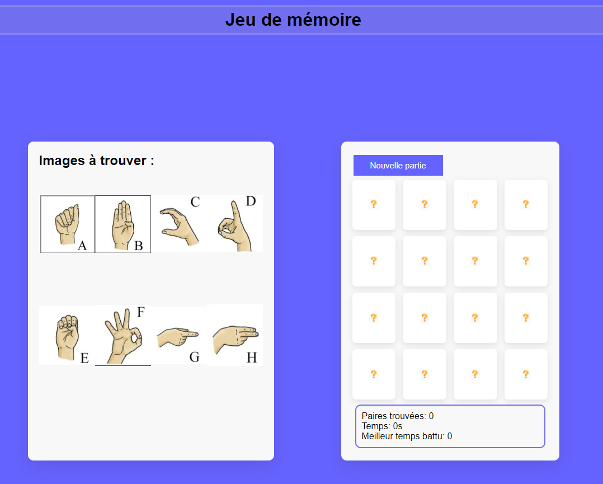
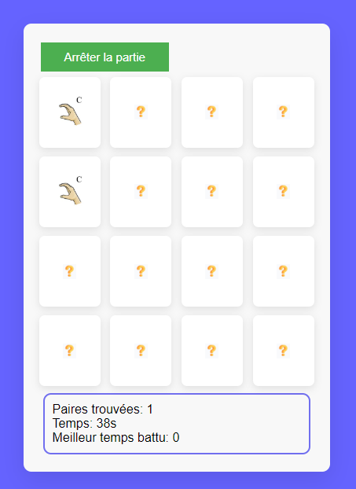
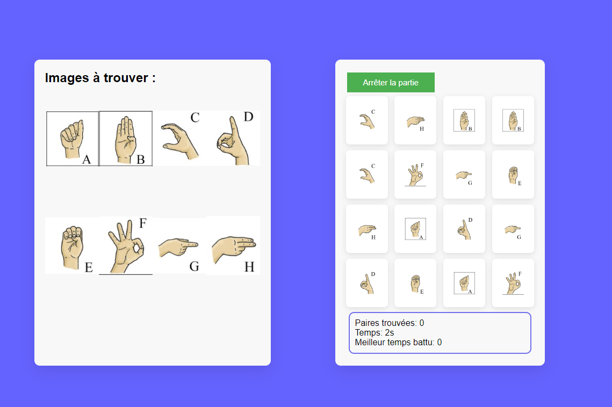
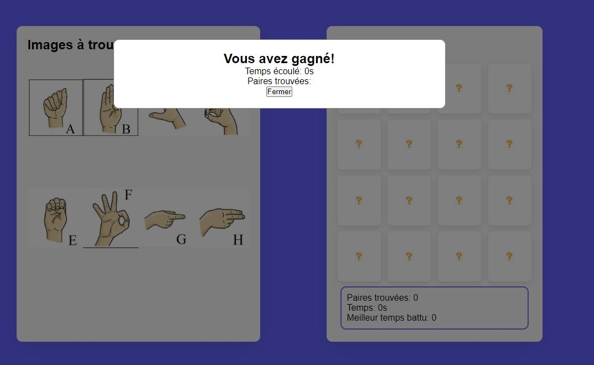

# Jeu de Memoire

Le jeu consiste à trouver 8 paires d'images en un temps record.

# Regles du jeu

# A chaque nouvelle partie:

On réinitialise la position des images aléatoirement.
Toutes les images cachées sont affichées un laps de temps puis recouvertes;
Le nombre de paires trouvées est remis à zéro ainsi que le temps écoulé.
Le bouton affichant "Arrêter la partie" affiche maintenant le message initial "Nouvelle partie"

# Durant la partie :

L'utilisateur clique sur deux images;
Les images s'affichent un laps de temps;
Si les images sont différentes, elles sont cachées de nouveau, sinon elles restent affichées et on incrémente le nombre de paires trouvées.
Durant ce temps, le nombre de secondes écoulées depuis le début de la partie courante s'accumule;
Le bouton affichant initialement "Nouvelle partie" doit afficher "Arrêter la partie"
La fin d'une partie est atteinte lorsque toutes les paires sont découvertes.

# A la fin de chaque partie:

Un message de félicitations est affiché donnant le temps écoulé (dans une fenêtre);
Le meilleur temps est vérifié.
De ce fait dans une fenêtre, un message est affiché si le meilleur temps est battu.

# Équipe
Sara Salek
